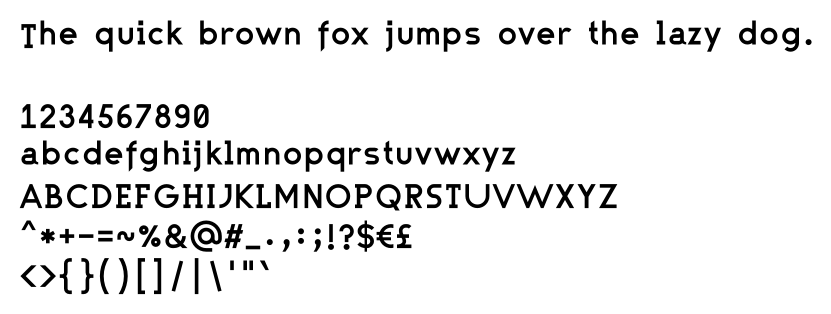
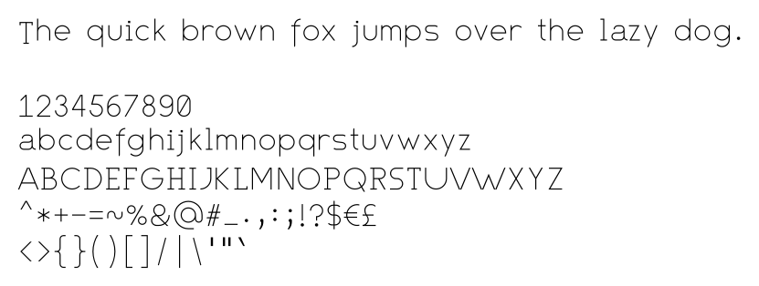
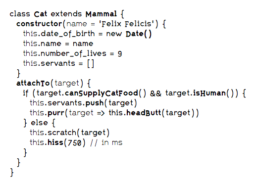
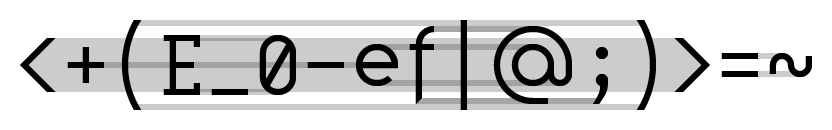

# Fifteen

Fifteen is a proportionally sized typeface optimized for source code. It was initially developed as an experiment in font metrics and has since evolved as my personal typeface for both source code and identity. As such, it is still very much under active construction and receives frequent updates.






## A typeface designed for source code

Fifteen needs a little time to get used to. It differs from traditional typefaces for source code in two distinct ways: it is proportionally sized, and it doesn't strictly use the baseline to align the characters to.

Reading source code in characters that are aligned in a grid (as monospaced typefaces are) has its advantages, which is why it is the default approach. It has certain disadvantages too though that simply can't be solved within a monospaced grid. The limited space within the fixed size of a glyph box restricts the possibilities to make clear distinctions between similar looking characters (i.e. uppercase O vs. the number 0). Besides cramming as much information in a limited area, that fixed size also dictates the horizontal rhythm of your code. It makes it harder to read code as a natural language. Proportionally sized typefaces have the potential to solve these two issues. The primary downside to them is losing the ability to align your code, apart from leading whitespace, which is obviously not an issue.



Fifteen is designed on a 15px tall grid, of which 7px are used for the x-height, with a stroke width of 1px for Regular (1.5px for Bold, and 0.5px for Light). The glyphs themselves are constructed from simple geometric shapes, to stay close to the conceptual shape of their respective characters; i.e. an o is a circle.

However, the thing you either love or hate about Fifteen, is the vertical alignment of the characters; or rather, the fact that numbers and capitals aren't aligned to the baseline. Instead, (almost) everything is vertically centered, creating visually pleasing horizontal kebabs of code.



## Character sets and font variants

Regarding characters: ASCII > Latin > Greek &amp; Cyrillic

Regarding weights: Regular > Bold > Light

I have plans for making tests (of the ASCII subset) for a monospaced, italics, and one classically aligned to the baseline. These tests have low priority though.

Fifteen currently comes in at a little over a thousand glyphs, most of them available in Regular, Bold and Light. The table below displays various character sets and how well they are covered.

| Character Set | Glyphs | Regular | Bold | Light | Coverage |
| --- | --- | --- | --- | --- | --- |
| ASCII | 95 | 95 | 95 | 95 | **100%** |
| Windows 1252 | 217 | 217 | 217 | 217 | **100%** |
| Mac Roman | 242 | 242 | 242 | 242 | **100%** |
| WGL4 | 655 | 655 | 564 | 534 | 89.2% |
| MES-1 | 335 | 335 | 335 | 335 | **100%** |
| Google Fonts Core | 216 | 216 | 216 | 216 | **100%** |
| Google Fonts Plus | 370 | 370 | 370 | 370 | **100%** |
| Google Fonts Pro | 145 | 145 | 143 | 143 | 99.1% |

\*) These numbers are (somewhat) accurate as of 2017-10-11

## Downloads and webfont

Check the [releases](https://github.com/burodepeper/fifteen/releases) page for the most recent 'official' builds. You can find versions for both desktop and webfont usage there.

If you want the latest of the latest, you can find the most recent builds in the [build](https://github.com/burodepeper/fifteen/tree/master/build) directory. Note that these builds will most likely contain bugs and glitches.

The latest stable release (v1.002) contains the subsets ASCII, Latin-1 Supplement and Google Fonts Core for a total of 216 glyphs. If you want the full width, you'll have to build the fonts yourself.

### Webfont via CDN

Include the following line in your `<head>` and then use `font-family: "Fifteen-Web"` in your CSS. Bold (`font-weight: 700`) and Light (`font-weight: 300`) are included.

```html
<link rel='stylesheet' href='https://cdn.jsdelivr.net/npm/fifteen/build/web/Fifteen-Web.css'>
```

[](https://www.jsdelivr.com/package/npm/fifteen)

## Development

Fifteen is primarily developed as my personal typeface, and most considerations made are based on my environment and obviously heavily opinionated. I tend to tweak things almost on a daily basis, to get it _just right_.

I've made it publicly available, both in source and usage, because I believe it has grown to a point where it could be interesting to others. I welcome and appreciate your feedback and suggestions.

### Contributions

If you are interested in contributing to this project, I very much welcome you, but please contact me first via this repo. Because of the personal nature of this project, it would be a shame if your contribution wouldn't be used.

Fifteen is designed and developed using [Glyphs](https://www.glyphsapp.com) which is a prerequisite for working from source.

### Focus of further development

Below is a summary of my current aims and interests.

- [ ] **Maintenance**
  - [ ] Share glyph bearings (instead of kerning)
  - [ ] Kerning and spacing
    - [ ] Consecutive `###`
    - [ ] `sp`, `sh`
    - [ ] `Wi`
    - [ ] `pp`
    - [ ] `□■`
  - [ ] Better re-use of components
  - [ ] Switch to Open Font License?
- [ ] **Glyph Design**
  - [ ] **Character set compliancy**
    - [ ] WGL4
      - [ ] Bold
      - [ ] Light
    - [ ] Google Fonts Pro
      - [ ] Bold
      - [ ] Light
  - [ ] **ASCII improvements**
    - [ ] `W` (U+0057): less wide
    - [ ] `w` (U+0077): less wide
  - [ ] Greek
  - [ ] Cyrillic
  - [ ] **Alternatives** for:
    - [ ] `a`: circle with small stem
    - [ ] `g`: old-fashioned g
- [ ] **Variants**
  - [ ] Mono (experiment with ASCII at first, perhaps a larger subset at a later stage)
  - [ ] Baseline (ASCII characters aligned to baseline, as a test)
  - [ ] Italic (just ASCII at first)
  - [ ] Bold Italic

### Known issues

- Glyphs with (complex) diacritics will most likely be clipped in certain software, especially on Windows.

## License

Fifteen is released under the [MIT License](LICENSE).

While not strictly part of the license, if you intend to use Fifteen in a substantial way, I obviously like to hear about it.
