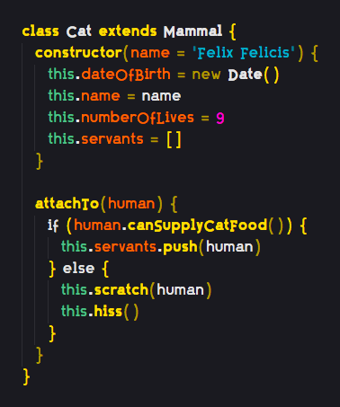
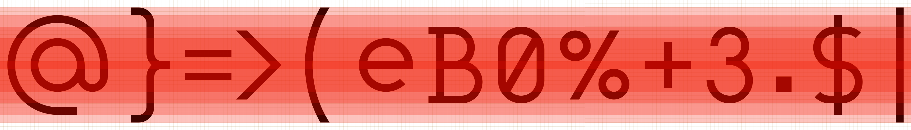
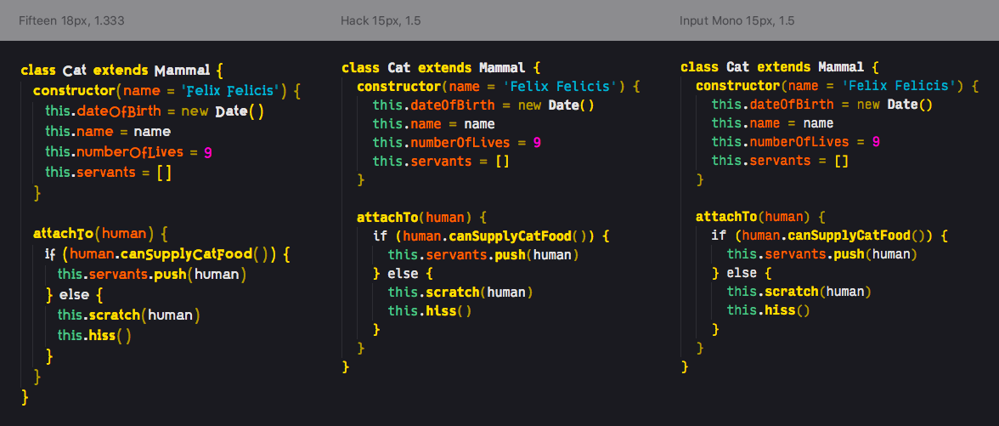
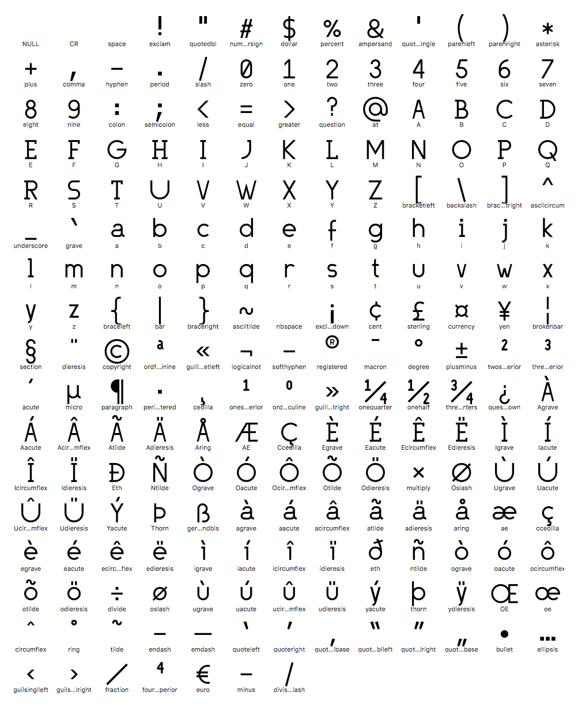

# Fifteen

**Very much still under construction**

Fifteen is a proportionally sized typeface optimized for source code. It is an experiment.

Fifteen is designed on a 15px tall grid (unusually large), with a small x-height (unusually small), and relatively wide glyph boxes (unusual). It is not designed to cram as much code in as little space as possible. It also does not align its glyphs to a baseline (as is traditional), but instead vertically centers everything. To distinguish between different groups of characters, various consistently used heights are used that act as 'colors'.

The image below gives an idea how this vertical centering works. It takes a little getting used to, because we're used to seeing all glyphs, in particular the uppercase and lowercase letters, aligned to a baseline. This centered approach however, allows all characters to be neatly aligned with various forms of punctuation and parentheses, both of which are very often used in programming.

### Differences with monospaced fonts

The biggest difference with monospaced fonts is the horizontal rhythm of the characters. Due to its nature, monospaced fonts produce a rigid two dimensional grid on a page. This has certain advantages, but it also creates a distorted shape of many characters. The lowercase `i` has difficulty filling its box, and the `m` becomes a blob at smaller sizes. Due to these constraints, certain characters automatically start to look alike, because there's not enough 'resolution' to distinguish between them. Another disadvantage is the fact the kerning can't be used to optimize combinations or sequences of characters.

By dropping this limitation, and instead adapting a variable width of characters, a much more natural feel can be created.
The downside is that code alignment becomes practically impossible, and tabular data becomes tricky if lines contain other data as well.
It remains a matter of preference obviously.

The example below shows the difference between Hack (of which I am part of the development, and which used to be my default), Input Mono (which I've grown fond of as an alternative to Hack), and Fifteen. The examples are shown with the settings that I had applied to them. What strikes me most is that the amount of visible code is roughly the same (though I feel Fifteen needs a little extra vertical breathing room), but that the larger punctuation make Fifteen a lot easier to read.

## Character set

Fifteen currently offers a basic set of glyphs (well over 200), in Regular and Bold, that should suffice for most programming needs in Western languages.

In addition, the Regular weight holds about 1000 glyphs.

| Character Set | Glyphs | Compliance |
| --- | --- | --- |
| ASCII | 95/95 | **100%** |
| Windows 1252 | 217/217 | **100%** |
| Mac Roman | 242/242 | **100%** |
| WGL4 | ?/? | ? |
| MES-1 | 334/335 | 99.7% |
| Google Fonts Core | 216/216 | **100%** |
| Google Fonts Plus | 365/370 | 98.6% |
| Google Fonts Pro | 139/145 | 95.9% |

## Under development

Fifteen is constantly being developed as I use it during my normal work. Your feedback is appreciated. PRs are welcome, but please discuss your intentions before submitting a patch, as this project isn't set up as collaborative effort (yet).

## Downloads

- Desktop usage: [download the .ttf files](build/ttf/Fifteen.zip), and install as your normally would.
- Webfont usage: use the latest version via the CDN (recommended, see below), or [download the .woff and .woff2 files](build/web/Fifteen-Web.zip), and do your thing.

### Webfont (via CDN)

TODO: jsDelivr (via NPM)

## License

Fifteen is released under the [MIT License](LICENSE]).
